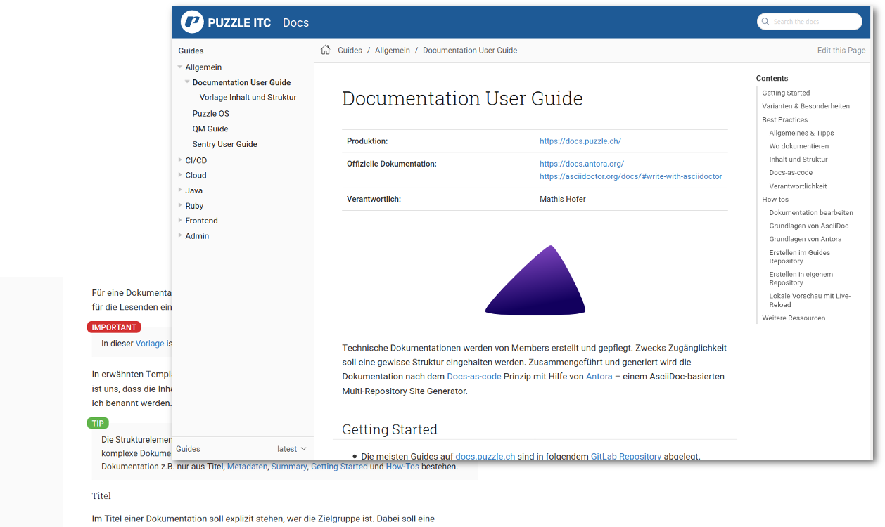

<!-- .slide: class="master01" -->

Willkommen zum

# Remote Tech Workshop 2020

Rocket.Chat: [#tws20](https://chat.puzzle.ch/channel/tws20)

---

<!-- .slide: class="text-left" -->
## Programm

<table>
  <tr>
    <td><b>09:00</b></td>
    <td>
      Begrüssung 
      <small style="color: gray;">Thömu</small>
    </td>
  </tr>
  <tr>
    <td>09:05</td>
    <td>
      Techboard Epics Update 
      <small style="color: gray;">Dani & Stefan</small>
    </td>
  </tr>
    <tr>
    <td>09:20</td>
    <td>
      EBRAINS Knowledge Graph 
      <small style="color: gray;">Oli Schmid, EPFL</small>
    </td>
  </tr>
    <tr>
    <td>09:50</td>
    <td>1. Teil Mini Workshops</td>
  </tr>
  <tr>
    <td>12:00</td>
    <td>Mittag</td>
  </tr>
</table>
<table>
  <tr>
    <td><b>13:00</b></td>
    <td>
      In 15 Minuten von dev zu prod mit ESTA-Cloud@SBB IT: Die CI/CD Pipeline der SBB&nbsp;IT 
      <small style="color: gray;"> Daniel Marthaler, SBB</small>
    </td>
  </tr>
    <tr>
    <td>13:30</td>
    <td>Projektspeeddating</td>
  </tr>
    <tr>
    <td>13:50</td>
    <td>2. Teil Mini Workshops</td>
  </tr>
    <tr>
    <td>16:40 &amp;&nbsp;16:50</td>
    <td>Präsentation Resultate Mini Workshops</td>
  </tr>
  <tr>
    <td><b>17:00</b></td>
    <td>Remote-Feierabendbier</td>
  </tr>
</table>

---

<!-- .slide: class="master01" -->

# Techboard Epics Update

---

<!-- .slide: class="master02" -->
# Epic 1: Docs

---

<!-- .slide: class="text-left" -->
## Wieso Docs?

* Umfrage /mid Week (Nov '19)
* Puzzle Lunch: [Techboard Pain Points](https://wiki.puzzle.ch/Puzzle/PainPoints2020) (Jan '20)

* Hotspot: Dokumentation

---

<!-- .slide: class="text-left" -->
## 🤬 Doku ?!

* Best Practices nicht dokumentiert
* Dokumentation nicht vorhanden oder outdated
* Durchmischung Administration/Anwendung
* Entry Point für technische Dokus fehlt
* Usability & Suche Wiki

---

<!-- .slide: class="text-left" -->
## 😍 Doku !!

* Docs-as-code (Git-basiert, Markup, gewohnter Editor)
* Doku Ownership
* Definierte Zielgruppe
    * Trennung von User Guides und Admin Guides
* Inhalte Einheitliche Strukturiert

---

<!-- .slide: class="text-center" -->
## ... introducing: Puzzle Docs

✨ docs.puzzle.ch ✨

  <!-- .element height="125%" width="125%" -->

---

## Puzzle Docs

* Some Pointers

---

<!-- .slide: class="text-left" -->
## What's Next

* TODO

<!-- .slide: class="master02" -->
# Epic 2: Pipelines

---
<!-- .slide: class="text-left" -->
## Jenkins OpenShift Operator

* Syncs tokens of service accounts into Jenkins
* Grants edit rights to these service accounts

&nbsp; &nbsp; &rArr; Projects can use own SAs in pipelines

---
<!-- .slide: class="text-left" -->
## Jenkins OpenShift Operator

* Enables namespace for Jenkins OpenShift Sync

&nbsp; &nbsp; &rArr; Trigger Jenkins pipelines from OpenShift  
&nbsp; &nbsp; &rArr; Configure pipelines, credentials & slaves in  
&nbsp; &nbsp; &rArr; OpenShift

Documentation: [Puzzle Jenkins Developer Guide](https://wiki.puzzle.ch/Puzzle/JenkinsDeveloperGuide#Jenkins_CI_47CD_Project_Operator)

---
<!-- .slide: class="text-left" -->
## Puzzle Jenkins Shared Library

New Steps:

<dl>
<dt>kustomize</dt>
<dd>Generates OpenShift objects with kustomize.</dd>
<dt>openshiftApply</dt>
<dd>Applies OpenShift objects to cluster,  prunes removed/renamed objects.</dd>
</dl>

---
<!-- .slide: class="text-left" -->
## Puzzle Jenkins Shared Library

<dl>
<dt>openshiftStartBuild</dt>
<dd>Starts a new build and waits for its completion,  
aborts the Jenkins job when the builds fails.</dd>
<dt>openshiftDiff</dt>
<dd>Diffs OpenShift objects against cluster.</dd>
</dl>

---
<!-- .slide: class="text-left" -->
## Puzzle Jenkins Shared Library

<dl>
<dt>replaceFromVault</dt>
<dd>Replaces variables in strings with Vault secrets.</dd>
<dt>withGitCrypt</dt>
<dd>Unlocks repo with git-crypt within scope of step.</dd>
</dl>

Documentation: [Jenkins > *Job* > Pipeline Syntax](https://jenkins.puzzle.ch/job/pitc-jenkins/job/build/job/pitc-shared-library-docs/job/resource-management/pipeline-syntax/globals)

---

<!-- .slide: class="text-left" -->
## Example Pipelines

* [pitc-wekan-cicd-pipeline](https://jenkins.puzzle.ch/view/pitc-tb-pipelines/job/pitc-wekan-cicd-pipeline/)
* [pitc-java-s2i-kustomize-pipeline-quickstart](https://jenkins.puzzle.ch/view/pitc-tb-pipelines/job/pitc-java-s2i-kustomize-pipeline-quickstart/)

---
<!-- .slide: class="text-left" -->
## What's Next

* Review and merge branch
* Write documentation
* Steps and examples for Helm and ArgoCD
* Versioning and promotion
* Images and library for GitLab
* [Wekan Board](https://wekan.puzzle.ch/b/NTF72iW8TBzxa7D9Z/technical-board)
